# q0 experiments

this repository contains two distinct experiments. they use different base models, hardware profiles, data partitions, and evaluation protocols, so their results must not be conflated:

- **historical 135M experiment:** an exploratory q0/GRPO run with `HuggingFaceTB/SmolLM2-135M-Instruct`, pinned to revision `12fd25f`. it established the snapshot, learned-prior, probability-mixture, and MOPD pipeline, but stayed close to the reasoning floor.
- **newer 1.5B experiment:** a laptop-oriented QLoRA run with `Qwen/Qwen2.5-1.5B-Instruct`, pinned to revision `989aa7980e4cf806f80c7fef2b1adb7bc71aa306`. it uses a deterministic 256-example validation slice and reports the more useful pass@k comparisons below.

## historical 135M experiment

### setup

the base model was `HuggingFaceTB/SmolLM2-135M-Instruct`. the run trained two independent GRPO trajectories for four cycles and saved each cycle boundary. cycles 1 and 2 used plain GRPO; cycles 3 and 4 added forward KL to the previous snapshot.

there were eight snapshots in the original pool. after training, all snapshots were frozen and softmax mixture weights were fitted with ordinary NLL on 512 held-out gold continuations. inference mixed the snapshots' next-token probabilities, not their generated strings. the learned top-k weights were renormalized before mixing.

this was a small systems check, not a compute-matched benchmark. the baseline received four passes over 2,048 examples. q0 used four cycles for each of two trajectories, so the snapshot pool saw twice as many training prompts.

[baseline checkpoints](https://huggingface.co/Pradheep1647/q0-gsm8k-135m-baseline) · [q0 snapshots and weights](https://huggingface.co/Pradheep1647/q0-gsm8k-135m) · [distilled checkpoint](https://huggingface.co/Pradheep1647/q0-gsm8k-135m-mopd)


### GSM8K exact match and pass@k

the original full-test evaluation used all 1,319 GSM8K test questions. exact match is the strict generated-answer score; pass@k samples multiple answers and counts a question as solved when at least one sample is correct.

| official test system | correct | exact match | pass@1 | pass@4 | pass@8 |
| --- | ---: | ---: | ---: | ---: | ---: |
| untouched base | 10/1319 | 0.758% | — | — | — |
| best baseline, pass 4 | 12/1319 | 0.910% | 0.78% | 2.85% | 5.16% |
| best q0 snapshot | 10/1319 | 0.758% | 0.54% | 2.03% | 3.79% |
| learned ensemble, k=8 | 11/1319 | 0.834% | — | — | — |
| uniform ensemble, k=8 | 12/1319 | 0.910% | — | — | — |
| distilled student, selected at step 8 | 12/1319 | 0.910% | 0.51% | 1.94% | 3.64% |


### MOPD

`train_mopd.py` added a final one-model consolidation stage inspired by [Multi-Teacher On-Policy Distillation](https://arxiv.org/abs/2606.30406). a fresh student started from the shared base and generated its own GSM8K response. four frozen top-ranked q0 snapshots scored those student prefixes, and the student minimized their average forward KL:

$$
\mathcal{L} = \frac{1}{4}\sum_{i=1}^{4} KL\left(p_{T_i} \parallel p_\theta\right).
$$

`mixture_weights.json` selected the top four snapshot names, but the learned numeric weights did not enter the loss; each teacher contributed equally. this was not an exact MOPD reproduction: the paper routes domains and uses reverse KL, while this run used shared-origin teachers, student-generated states, and direct forward-KL distillation.

The student ran one pass over 2,048 prompts and saved candidates at steps 8, 16, 24, and 32. selection used a fresh 512-question slice from the unused GSM8K training remainder. step 8 won with 5.47% validation pass@8, but that validation choice did not produce a pass@k win on the official test split.

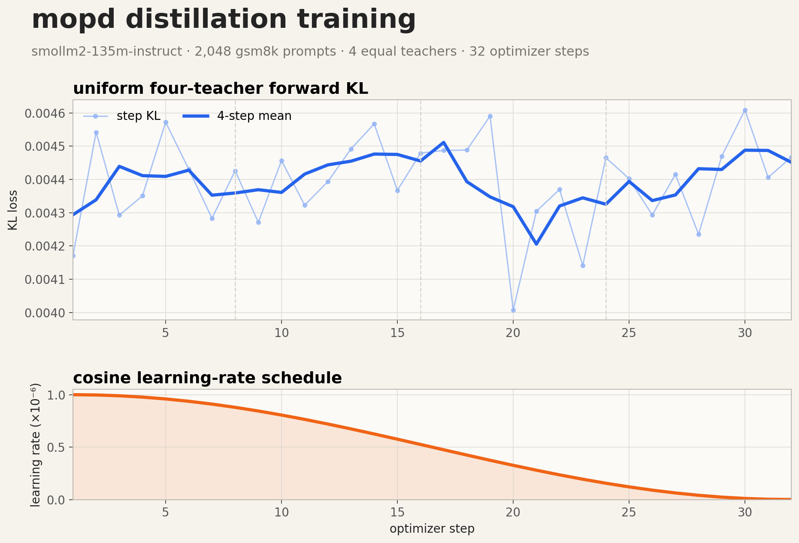

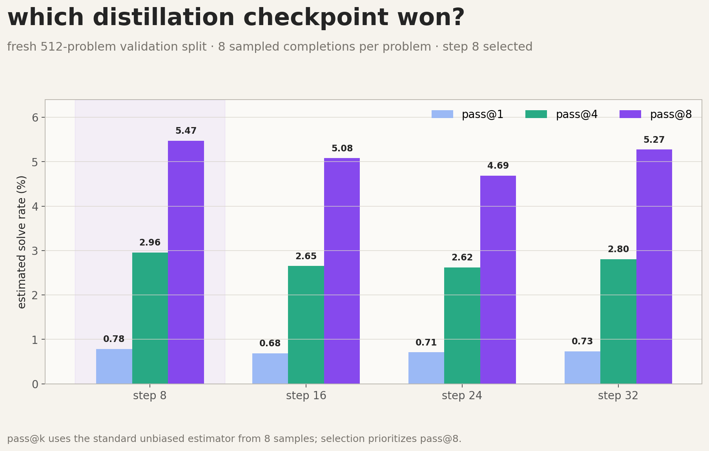

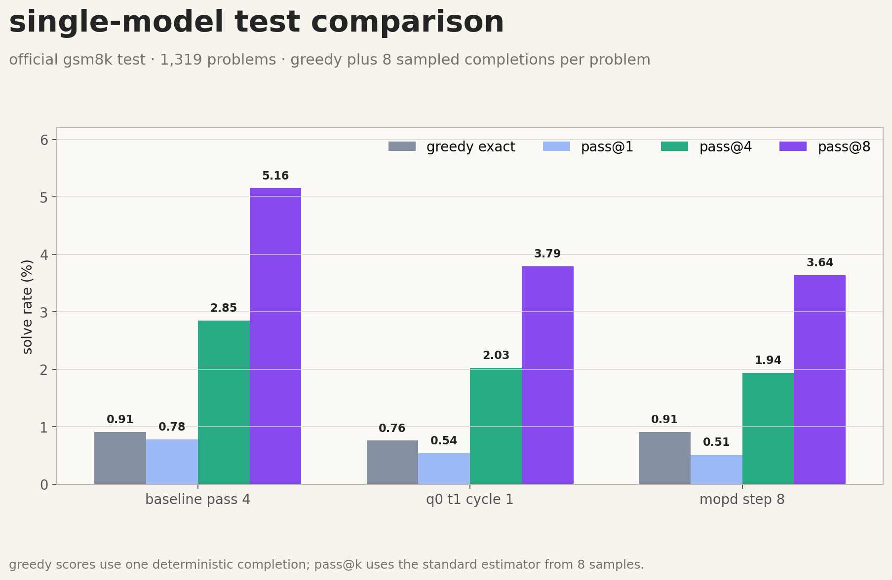

### MATH-500 transfer

the same selected 135M checkpoints were evaluated on all 500 MATH-500 problems with greedy decoding, a 256-token answer limit, and `math-verify` symbolic equivalence. nothing was retrained on MATH-500.

| system | correct | accuracy | parse rate | average response | generation time | peak cuda allocated |
| --- | ---: | ---: | ---: | ---: | ---: | ---: |
| baseline, pass 4 | 5/500 | 1.0% | 83.0% | 99.7 tokens | 4m 32s | 0.84 GiB |
| q0 best single | 5/500 | 1.0% | 85.6% | 115.6 tokens | 4m 24s | 0.84 GiB |
| q0 learned top-4 | 6/500 | 1.2% | 82.6% | 111.5 tokens | 17m 02s | 8.36 GiB |
| distilled student | 6/500 | 1.2% | 86.6% | 118.6 tokens | 4m 27s | 0.84 GiB |

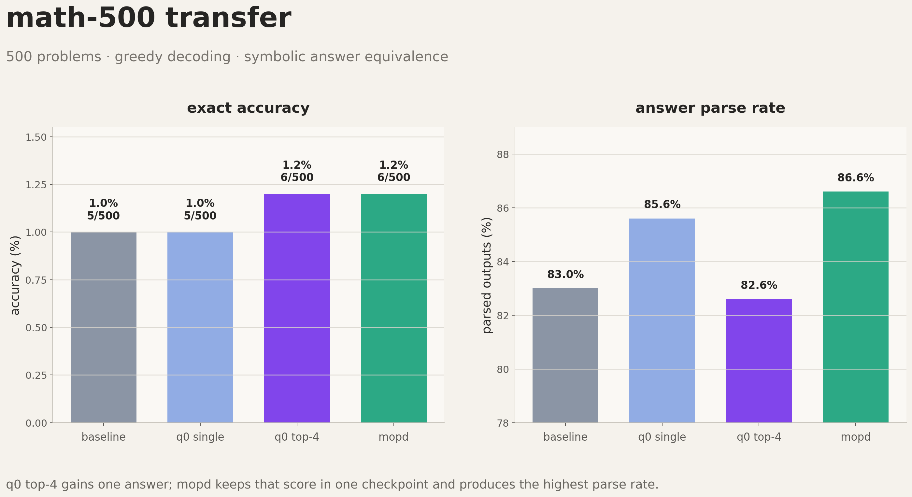

these are floor-level results. the learned top-4 and distilled student each solved 6/500, only one more than baseline. every system scored zero on counting, probability, and number theory. the transfer result agrees with GSM8K: q0-style ensembling and distillation work mechanically, but this 135M base is too weak to separate the methods reliably.

`math500_results.json` keeps the aggregate and breakdown results. `math500_predictions.jsonl` keeps all 2,000 scored generations for inspection.

### limitations

training reward improved more clearly than exact match. parse rate rose from 38.97% for the untouched base to 48.45% for baseline pass 4, while only two more questions became correct. the learned prior also did not rank snapshots by downstream exact match: it assigned 30.65% to trajectory 2 cycle 2, the weakest individual snapshot at 7/1,319, because the prior was fitted to teacher-forced token likelihood rather than generated-answer correctness.

learned weighting never beat uniform weighting here, and all systems solved only 7 to 12 official-test questions. a two-answer gap is too small to treat as an algorithmic win. the useful result is negative: the pipeline works, but this configuration does not show a GSM8K accuracy gain.

## newer 1.5B QLoRA laptop experiment

### setup and data partition

this run uses `Qwen/Qwen2.5-1.5B-Instruct` with 4-bit NF4 quantization and LoRA adapters (`r=8`, `alpha=16`, dropout `0.05`). it uses one q0 initialization, four cycles, and at most five retained snapshots. the local profile uses group size 2, temperature 0.8, top-p 0.95, a 192-token generation limit, learning rate `2e-5`, and 256 training prompts.

all partitions are deterministic after shuffling GSM8K with seed 42:

- `train[0:512]`: q0 fitness, used only to fit mixture weights
- `train[512:2560]`: q0 and MOPD training
- `train[2560:3072]`: validation, 256 questions
- official GSM8K test: 1,319 questions, held back for final evaluation

validation and official test are different measurements. validation selects checkpoints and mixtures during development; the official test is a separate held-out split. the numbers below do not treat a validation win as an official-test win, and there is no official-test q0/MOPD comparison in this run.

### q0 snapshots and learned mixture

q0 keeps cyclic snapshots from the same QLoRA trajectory: cycle 1 through cycle 4, plus the initial checkpoint when available. after the snapshots are frozen, q0 fits a softmax prior in probability space on the 512-question fitness slice. at each token position, it mixes the teachers' next-token distributions and then samples or decodes from that mixture.

for this run, the learned weights were approximately 70.52% for cycle 2, 29.41% for cycle 3, 0.068% for cycle 4, and 0.003% for cycle 1. q0 top3 wins the validation sweep, but top2 is the practical and published choice because cycle04 contributes only 0.068% of the learned weight.

### GSM8K validation results

these results use the deterministic 256-question validation slice and eight samples per question.

| system | n | pass@1 | pass@4 | pass@8 |
| --- | ---: | ---: | ---: | ---: |
| baseline GRPO | 256 | 29.54% | 55.84% | 67.19% |
| q0 k=1 | 256 | 56.64% | 80.90% | 87.50% |
| q0 k=2 | 256 | 58.50% | 79.97% | 85.55% |
| q0 k=3 | 256 | 59.47% | 82.32% | 88.28% |
| MOPD t=1, selected step 64 | 256 | 45.61% | 73.15% | 82.81% |
| MOPD t=2, selected step 192 | 256 | 49.07% | 76.29% | 84.77% |

q0 top3 is the validation winner by pass@8. top2 remains the practical choice for the transfer result because adding cycle04 brings only 0.068% learned weight and adds another adapter to inference.

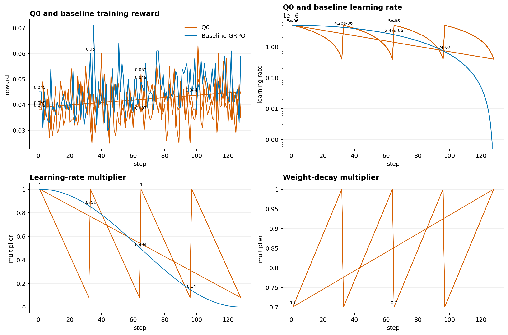

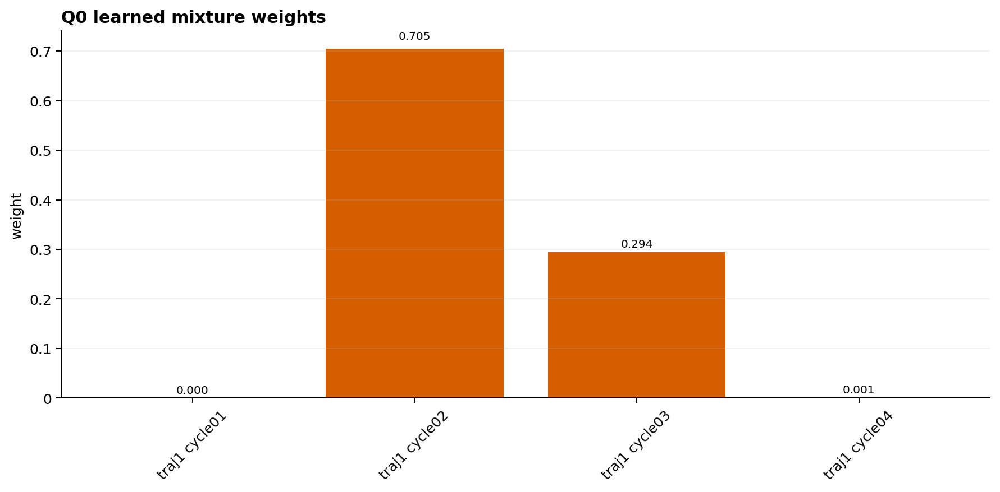

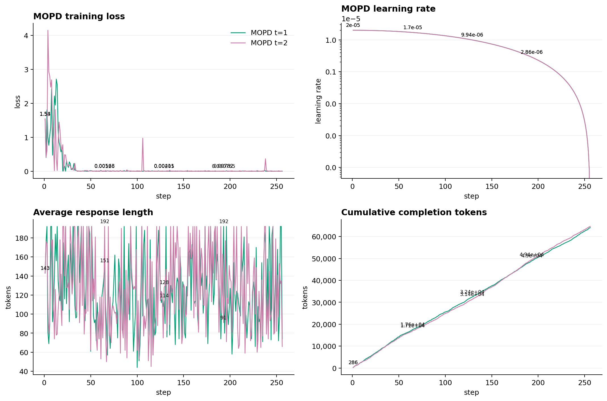

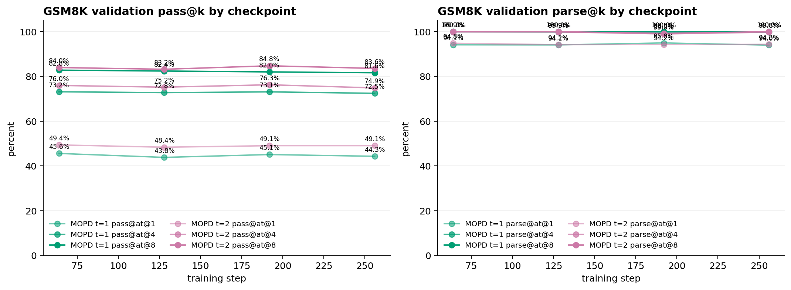

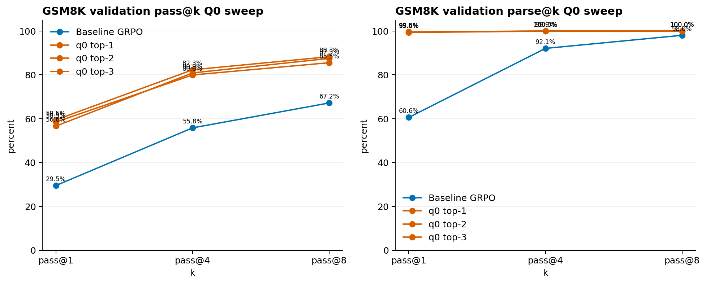

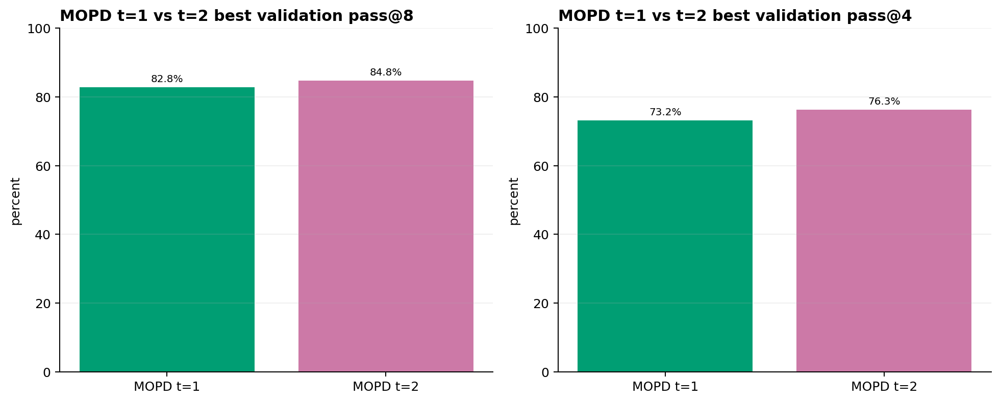

### official GSM8K test result

only the baseline was evaluated on the official 1,319-question GSM8K test split in the reported 1.5B results:

| system | n | pass@1 | pass@4 | pass@8 |
| --- | ---: | ---: | ---: | ---: |
| baseline GRPO | 1,319 | 26.07% | 51.20% | 62.32% |

this table is intentionally separate from the validation table. q0 and MOPD validation scores are not official-test scores, so they are not presented as a direct test-set comparison.

### MATH-500 transfer

MATH-500 is the separate 500-question test split. the model was trained on GSM8K, so this is transfer evaluation rather than additional MATH training. pass@k uses four sampled answers for the reported pass@4 values.

| system | n | pass@1 | pass@4 |
| --- | ---: | ---: | ---: |
| baseline GRPO | 500 | 10.65% | 25.00% |
| q0 top2 | 500 | 15.55% | 39.00% |
| MOPD t2 | 500 | 16.40% | 35.00% |

MOPD t2 wins pass@1 on MATH-500. q0 top2 wins pass@4. these are MATH-500 transfer results and should not be read as GSM8K official-test results.

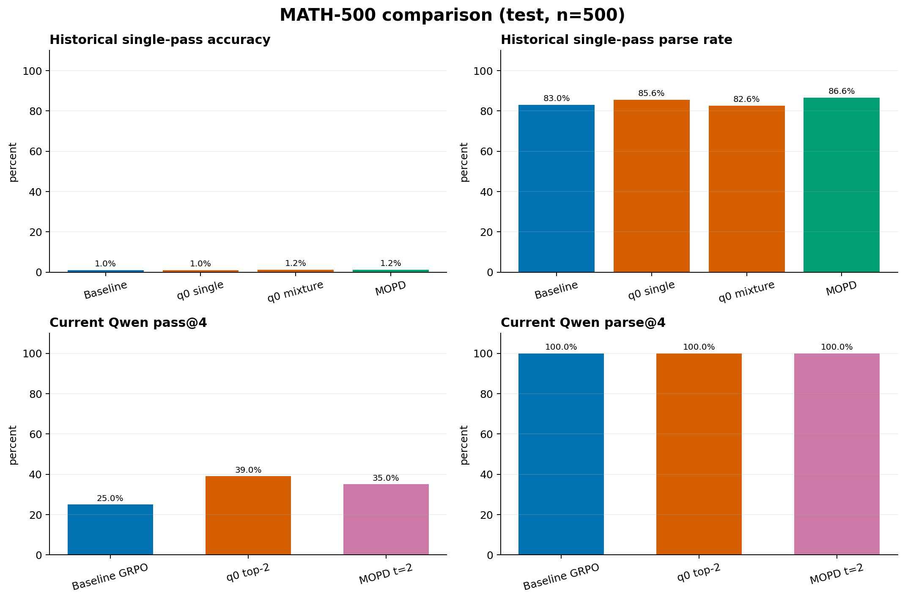

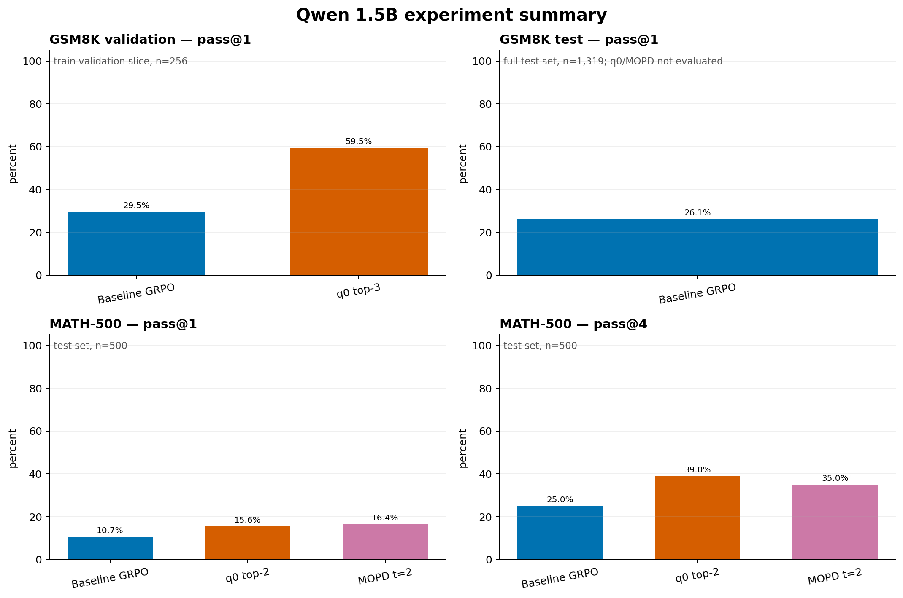

### files and run instructions

#### historical 135M files

- `core/train_grpo.py`: four-pass GRPO baseline
- `experiments/q0_mopd/train_q0_grpo.py`: cyclic trajectories, KL distillation, snapshots, and learned prior
- `experiments/q0_mopd/train_mopd.py`: one-pass on-policy distillation into one checkpoint
- `core/eval.py`: individual, distilled, pass@k, and probability-space ensemble evaluation
- `core/eval_math500.py`: deterministic MATH-500 transfer evaluation
- `experiments/q0_mopd/results/`: historical evaluation artifacts

#### 1.5B laptop files

- `experiments/q0_mopd/train_q0_grpo.py`: q0 training and fitness phases
- `experiments/q0_mopd/train_mopd.py`: MOPD training and validation
- `core/eval_passk.py`: pass@k evaluation for GSM8K and MATH-500
- `experiments/qwen_1_5b/plot_suite.py`: rebuilds the PNG graph suite and `metrics_summary.csv`
- `runs/q0_qwen1_5b_laptop/`: q0 snapshots and `mixture_weights.json`
- `runs/mopd_qwen1_5b_laptop/`: MOPD t=1 candidates and validation results
- `runs/mopd_qwen1_5b_laptop_t2/`: MOPD t=2 candidates and validation results
- `experiments/qwen_1_5b/figures/`: generated graphs

run the local laptop pipeline from the repository root with:

```bash
PYTHONPATH=core bash run_all.sh
```

`run_all.sh` defaults to the `qwen1_5b_laptop` profile and runs q0 training, q0 fitness, MOPD training, and MOPD validation. the baseline stage is intentionally not rerun. set `PROFILE`, `Q0_RUN_ID`, `MOPD_RUN_ID`, and the `*_EXTRA_ARGS` variables when continuing or changing output locations. the script expects the local training dependencies, a CUDA-capable environment, and access to the model weights.

for the separate full 1.5B GRPO profile on Modal, use the scripts in `experiments/qwen_1_5b/`:

```bash
modal run experiments/qwen_1_5b/modal_train_qwen.py
modal run experiments/qwen_1_5b/modal_eval_qwen.py
modal run experiments/qwen_1_5b/modal_math500_qwen.py
```

rebuild the graph suite with:

```bash
python experiments/qwen_1_5b/plot_suite.py
```

keep credentials out of shell variables and repository files.
