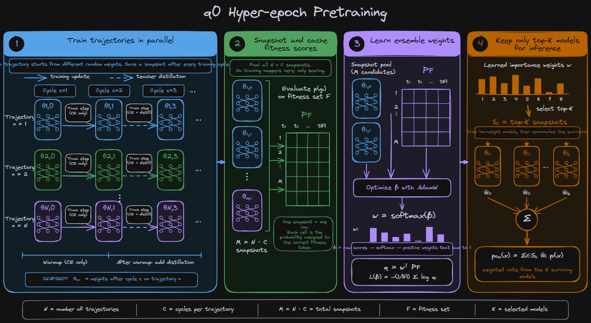
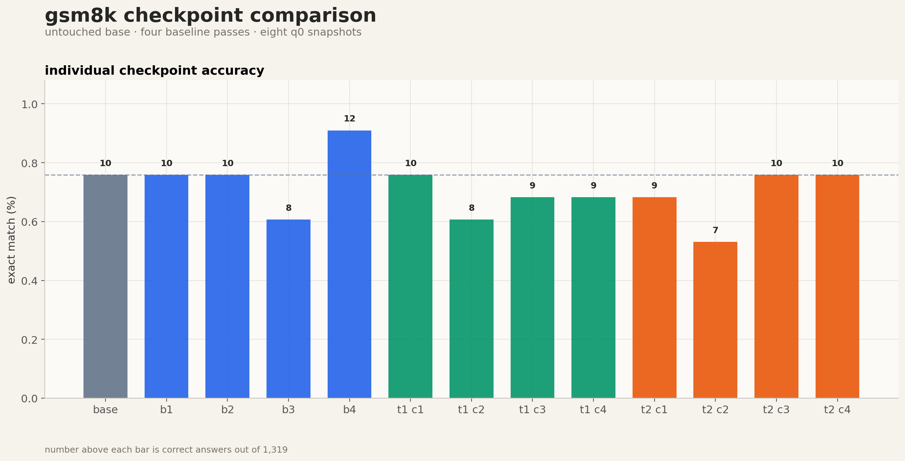
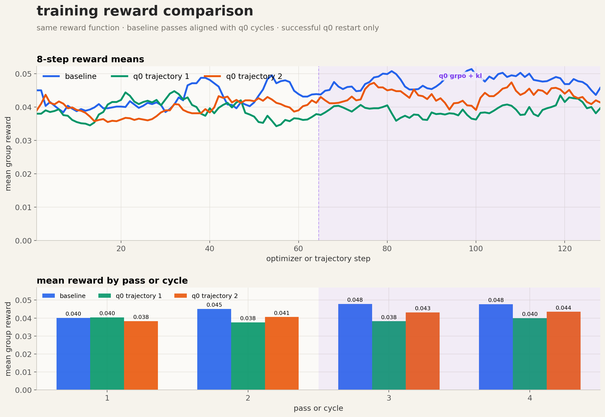
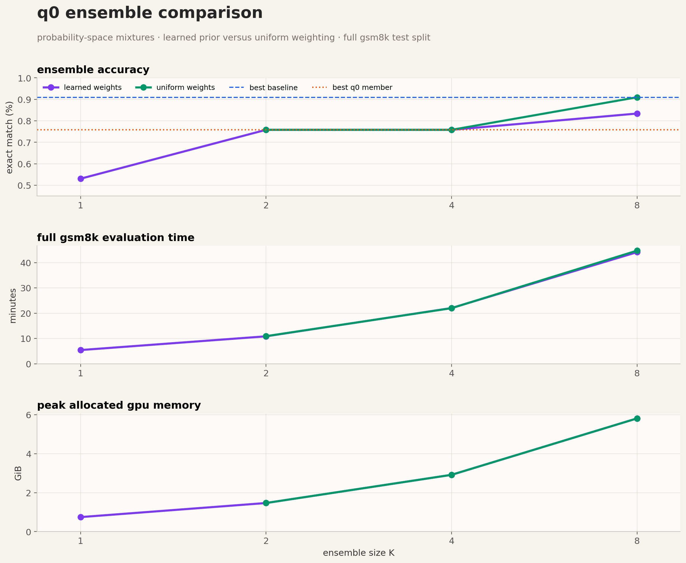
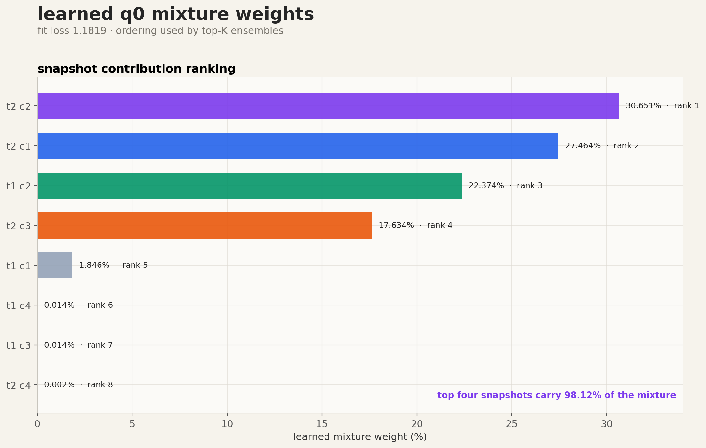

# q0 on gsm8k

a small, exploratory adaptation of [q0: Primitives for Hyper-Epoch Pretraining](https://arxiv.org/abs/2606.03938) to reasoning with GRPO. the base model is `HuggingFaceTB/SmolLM2-135M-Instruct`, pinned to revision `12fd25f`.

🤗 [baseline checkpoints](https://huggingface.co/Pradheep1647/q0-gsm8k-135m-baseline) · 🤗 [q0 snapshots and weights](https://huggingface.co/Pradheep1647/q0-gsm8k-135m)

## what this run does

the diagram reads left to right:

1. train two independent GRPO trajectories for four cycles and save every cycle boundary
2. use plain GRPO for cycles 1 and 2, then GRPO plus forward KL to the previous snapshot for cycles 3 and 4
3. freeze all eight snapshots and fit softmax mixture weights with ordinary NLL on 512 held-out gold continuations
4. keep the learned top-K snapshots, renormalize their weights, and mix their next-token probabilities at inference

the baseline gets four passes over 2,048 examples. q0 runs four cycles for each of two trajectories, so it uses twice the total training prompts across the snapshot pool. this is a small systems check, not a compute-matched benchmark.

## result

all numbers below use the complete 1,319-example GSM8K test split.

| system | correct | exact match |
| --- | ---: | ---: |
| untouched base | 10 | 0.758% |
| best baseline, pass 4 | 12 | 0.910% |
| best q0 snapshot | 10 | 0.758% |
| learned ensemble, K=8 | 11 | 0.834% |
| uniform ensemble, K=8 | 12 | 0.910% |

## how i read this

- training reward improved more clearly than exact match. part of that is formatting: parse rate rose from 38.97% for the untouched base to 48.45% for baseline pass 4, while only two more questions became correct.
- the learned prior did not rank snapshots by downstream accuracy. it gave 30.65% weight to trajectory 2 cycle 2, which was the weakest individual snapshot at 7/1,319. the prior was trained on teacher-forced token likelihood, not generated-answer exact match.
- learned weighting never beat uniform weighting here. uniform K=8 tied the best baseline at 12/1,319, while learned K=8 reached 11/1,319.
- the whole run sits close to the floor. with every system solving only 7 to 12 questions, a two-answer gap is too small to treat as evidence of an algorithmic win.

so the useful result is negative: this configuration validates the q0-style snapshot, prior-fitting, top-K, and probability-mixture pipeline, but it does not show a GSM8K accuracy gain. a stronger base model, repeated seeds, and a prior objective closer to generated-answer correctness are the next experiments i would trust.

## one-model follow-up

`train_mopd.py` adds one final consolidation stage inspired by [Multi-Teacher On-Policy Distillation](https://arxiv.org/abs/2606.30406). a fresh student starts from the shared base and generates its own GSM8K response. all four frozen top-ranked q0 snapshots score those exact student prefixes, then the student minimizes their average forward KL

$$
\mathcal{L} = \frac{1}{4}\sum_{i=1}^{4} KL\left(p_{T_i} \parallel p_\theta\right).
$$

`mixture_weights.json` is used only to choose the top-4 snapshot names. their numeric weights do not enter the loss; each teacher contributes equally. this is not an exact MOPD reproduction because the paper routes domains and uses reverse KL. this small variant keeps the shared-origin teachers and student-generated states, but uses direct forward-KL distillation. it runs one pass over the same 2,048 prompts and saves one `opsd.pt` checkpoint plus its own JSONL metrics.

the table above predates this follow-up, so it makes no accuracy claim for the distilled checkpoint yet. `run_all.sh` now trains it after q0 and evaluates it under the `mopd` result key. that comparison tells us whether the top-4 inference ensemble can be compressed into one model without losing its small gain.

## files

- `train_grpo.py`: four-pass GRPO baseline
- `train_q0_grpo.py`: cyclic trajectories, KL distillation, snapshots, and learned prior
- `train_mopd.py`: one-pass on-policy distillation into a single checkpoint
- `eval.py`: individual, distilled, and probability-space ensemble evaluation
- `run_all.sh`: baseline, q0, distillation, then evaluation
- `eval_results.json`, `mixture_weights.json`, and `run.log`: complete artifacts from the run
